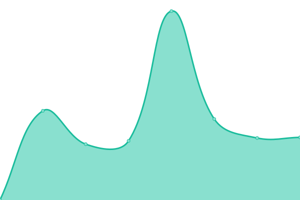

# [📈 Live Status](https://demo.upptime.js.org): <!--live status--> **🟩 All systems operational**

This repository contains the open-source uptime monitor and status page for [3flowcreative](http://www.3flowcreative.co.uk), powered by [Upptime](https://github.com/upptime/upptime).

With [Upptime](https://upptime.js.org), you can get your own unlimited and free uptime monitor and status page, powered entirely by a GitHub repository. We use [Issues](https://github.com/3flowcreative/upptime/issues) as incident reports, [Actions](https://github.com/3flowcreative/upptime/actions) as uptime monitors, and [Pages](https://demo.upptime.js.org) for the status page.

<!--start: status pages-->
<!-- This summary is generated by Upptime (https://github.com/upptime/upptime) -->
<!-- Do not edit this manually, your changes will be overwritten -->
<!-- prettier-ignore -->
| URL | Status | History | Response Time | Uptime |
| --- | ------ | ------- | ------------- | ------ |
|  [Aldanat Care](https://aldanatcare.co.uk/) | 🟩 Up | [aldanat-care.yml](https://github.com/3flowcreative/upptime/commits/HEAD/history/aldanat-care.yml) | 

 1936ms
     
 | 

<a href="https://3flowcreative.github.io/upptime/history/aldanat-care">100.00%</a>
    

|  [Blissful Care Homes](https://blissfulcarehomes.com/) | 🟩 Up | [blissful-care-homes.yml](https://github.com/3flowcreative/upptime/commits/HEAD/history/blissful-care-homes.yml) | 

 1107ms
     
 | 

<a href="https://3flowcreative.github.io/upptime/history/blissful-care-homes">100.00%</a>
    

|  [Calibration Select](https://calibrationselect.co.uk/) | 🟩 Up | [calibration-select.yml](https://github.com/3flowcreative/upptime/commits/HEAD/history/calibration-select.yml) | 

 3117ms
     
 | 

<a href="https://3flowcreative.github.io/upptime/history/calibration-select">93.44%</a>
    

|  [CareTech Foundation](https://www.caretechfoundation.org.uk/) | 🟩 Up | [care-tech-foundation.yml](https://github.com/3flowcreative/upptime/commits/HEAD/history/care-tech-foundation.yml) | 

 1674ms
     
 | 

<a href="https://3flowcreative.github.io/upptime/history/care-tech-foundation">100.00%</a>
    

|  [Casterbridge Home Care](https://casterbridgehomecare.co.uk/) | 🟩 Up | [casterbridge-home-care.yml](https://github.com/3flowcreative/upptime/commits/HEAD/history/casterbridge-home-care.yml) | 

 690ms
     
 | 

<a href="https://3flowcreative.github.io/upptime/history/casterbridge-home-care">100.00%</a>
    

|  [Casterbridge Manor](https://casterbridgemanor.co.uk/) | 🟩 Up | [casterbridge-manor.yml](https://github.com/3flowcreative/upptime/commits/HEAD/history/casterbridge-manor.yml) | 

 695ms
     
 | 

<a href="https://3flowcreative.github.io/upptime/history/casterbridge-manor">100.00%</a>
    

|  [Casterbridge Lodge](https://casterbridgelodge.co.uk/) | 🟩 Up | [casterbridge-lodge.yml](https://github.com/3flowcreative/upptime/commits/HEAD/history/casterbridge-lodge.yml) | 

 676ms
     
 | 

<a href="https://3flowcreative.github.io/upptime/history/casterbridge-lodge">100.00%</a>
    

|  [Capricorn Beach Cottages](https://capricornbeachcottages.com/) | 🟩 Up | [capricorn-beach-cottages.yml](https://github.com/3flowcreative/upptime/commits/HEAD/history/capricorn-beach-cottages.yml) | 

 1095ms
     
 | 

<a href="https://3flowcreative.github.io/upptime/history/capricorn-beach-cottages">100.00%</a>
    

|  [Championing Social Care](https://championingsocialcare.org.uk/) | 🟩 Up | [championing-social-care.yml](https://github.com/3flowcreative/upptime/commits/HEAD/history/championing-social-care.yml) | 

 1688ms
     
 | 

<a href="https://3flowcreative.github.io/upptime/history/championing-social-care">100.00%</a>
    

|  [Cosaraf](https://www.cosaraf.org/) | 🟩 Up | [cosaraf.yml](https://github.com/3flowcreative/upptime/commits/HEAD/history/cosaraf.yml) | 

 1009ms
     
 | 

<a href="https://3flowcreative.github.io/upptime/history/cosaraf">100.00%</a>
    

|  [Golden Key Estates](https://goldenkeyestates.co.uk/) | 🟩 Up | [golden-key-estates.yml](https://github.com/3flowcreative/upptime/commits/HEAD/history/golden-key-estates.yml) | 

 876ms
     
 | 

<a href="https://3flowcreative.github.io/upptime/history/golden-key-estates">100.00%</a>
    

|  [JKSM](https://jksm.org.uk/) | 🟩 Up | [jksm.yml](https://github.com/3flowcreative/upptime/commits/HEAD/history/jksm.yml) | 

 733ms
     
 | 

<a href="https://3flowcreative.github.io/upptime/history/jksm">100.00%</a>
    

|  [Kent Finance](https://kentfinance.co.uk/) | 🟩 Up | [kent-finance.yml](https://github.com/3flowcreative/upptime/commits/HEAD/history/kent-finance.yml) | 

 6345ms
     
 | 

<a href="https://3flowcreative.github.io/upptime/history/kent-finance">99.80%</a>
    

|  [Precious](https://www.precious-homes.co.uk/) | 🟩 Up | [precious.yml](https://github.com/3flowcreative/upptime/commits/HEAD/history/precious.yml) | 

 828ms
     
 | 

<a href="https://3flowcreative.github.io/upptime/history/precious">100.00%</a>
    

|  [Phoenix Communications](https://phoenixcommunications.co.uk/) | 🟩 Up | [phoenix-communications.yml](https://github.com/3flowcreative/upptime/commits/HEAD/history/phoenix-communications.yml) | 

 1598ms
     
 | 

<a href="https://3flowcreative.github.io/upptime/history/phoenix-communications">100.00%</a>
    

|  [Prominence Property](https://prominenceproperty.co.uk/) | 🟩 Up | [prominence-property.yml](https://github.com/3flowcreative/upptime/commits/HEAD/history/prominence-property.yml) | 

 846ms
     
 | 

<a href="https://3flowcreative.github.io/upptime/history/prominence-property">100.00%</a>
    

|  [Resolute Mining](https://www.rml.com.au/) | 🟩 Up | [resolute-mining.yml](https://github.com/3flowcreative/upptime/commits/HEAD/history/resolute-mining.yml) | 

 1803ms
     
 | 

<a href="https://3flowcreative.github.io/upptime/history/resolute-mining">100.00%</a>
    

|  [Student Key Estates](https://studentkeyestates.co.uk/) | 🟩 Up | [student-key-estates.yml](https://github.com/3flowcreative/upptime/commits/HEAD/history/student-key-estates.yml) | 

 1255ms
     
 | 

<a href="https://3flowcreative.github.io/upptime/history/student-key-estates">100.00%</a>
    

|  [Twenty-Four Seven](https://tf-7.co.uk/) | 🟩 Up | [twenty-four-seven.yml](https://github.com/3flowcreative/upptime/commits/HEAD/history/twenty-four-seven.yml) | 

 1306ms
     
 | 

<a href="https://3flowcreative.github.io/upptime/history/twenty-four-seven">100.00%</a>
    

|  [Wentworth Court](http://wentworthct.com/) | 🟩 Up | [wentworth-court.yml](https://github.com/3flowcreative/upptime/commits/HEAD/history/wentworth-court.yml) | 

 1700ms
     
 | 

<a href="https://3flowcreative.github.io/upptime/history/wentworth-court">100.00%</a>
    

|  [Wentworth Manor](http://wentworthmnr.com/) | 🟩 Up | [wentworth-manor.yml](https://github.com/3flowcreative/upptime/commits/HEAD/history/wentworth-manor.yml) | 

 1657ms
     
 | 

<a href="https://3flowcreative.github.io/upptime/history/wentworth-manor">100.00%</a>
    

<!--end: status pages-->

[**Visit our status website →**](https://demo.upptime.js.org)

## 📄 License

- Powered by: [Upptime](https://github.com/upptime/upptime)
- Code: [MIT](./LICENSE) © [3flowcreative](http://www.3flowcreative.co.uk)
- Data in the `./history` directory: [Open Database License](https://opendatacommons.org/licenses/odbl/1-0/)
